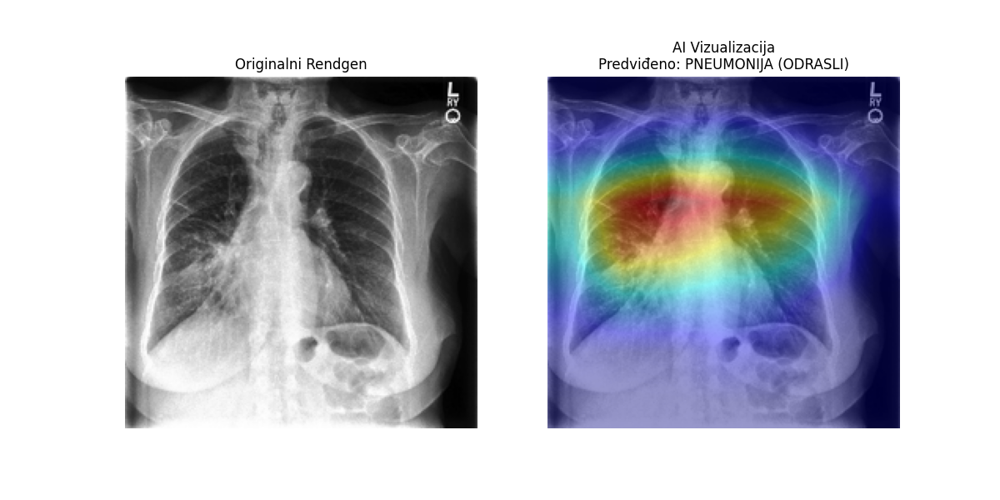

# Detekcija učenja prečaca (Shortcut Learning) u radiologiji pomoću Grad-CAM-a

Ovaj projekt istražuje fenomen gdje modeli dubokog učenja postaju "točni iz pogrešnih razloga". 

## Opis problema
Model (EfficientNet-B0) treniran je na specifičnom skupu podataka gdje su:
- **Zdravi pacijenti** isključivo djeca.
- **Pacijenti s upalom pluća** isključivo odrasle osobe.

Iako model postiže **100% točnosti**, on ne prepoznaje bolest, već samo razlikuje dječju anatomiju od odrasle.

## Korištene tehnologije
- **PyTorch** & **Torchvision** (EfficientNet-B0)
- **Grad-CAM** (za vizualizaciju fokusa mreže)
- **OpenCV** & **Matplotlib** (za obradu slika i grafove)

## Rezultati
Korištenjem Grad-CAM-a (skripta `raskrinkavanje.py`), dokazali smo da model fokusira centralni dio prsnog koša (anatomske markere odraslih), a potpuno zanemaruje plućni parenhim gdje se nalazi upala.

